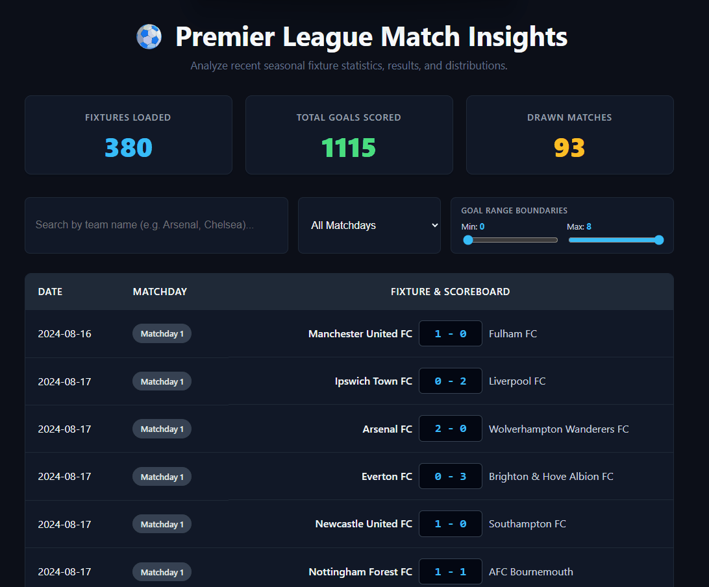

# Web Development Project 5 - Premier League Match Insights

Submitted by: **Harold Alexander Silva**

This web app: **Serves as an interactive soccer analytics dashboard that pulls real-time fixture logs directly from the 2024-25 Premier League season via a public API. I designed it to track high-level season metrics and provide powerful simultaneous filtering tools—including a team text search, matchday categorical sorting, and a custom mathematical boundary goal-slider—allowing users to seamlessly isolate specific tactical distributions of match data.**

Time spent: **12** hours spent in total

## Required Features

The following **required** functionality is completed:

- [x] **The site has a dashboard displaying a list of data fetched using an API call**
  - The dashboard displays at least 10 unique items, one per row
  - The dashboard includes at least two features in each row (I display match dates, specific matchday rounds, and localized match scorelines)
- [x] **`useEffect` React hook and `async`/`await` are used**
- [x] **The app dashboard includes at least three summary statistics about the data** - My app dashboard includes at least three summary statistics about the data, which are:
    - **Fixtures Loaded:** A total count of active match rows processed in the current array pool (380 matches total).
    - **Total Goals Scored:** An aggregated numerical sum tracking every single home and away goal registered across the season.
    - **Drawn Matches:** A dynamic calculation isolating games where the scorelines ended completely level.
- [x] **A search bar allows the user to search for an item in the fetched data**
  - The search bar **correctly** filters items in the list, only displaying items matching the search query
  - The list of results dynamically updates as the user types into the search bar
- [x] **An additional filter allows the user to restrict displayed items by specified categories**
  - The filter restricts items in the list using a **different attribute** than the search bar (I filter categorically by individual tournament stages/Matchdays rather than character team names)
  - The filter **correctly** filters items in the list, only displaying items matching the filter attribute in the dashboard
  - The dashboard list dynamically updates as the user adjusts the filter

The following **optional** features are implemented:

- [x] Multiple filters can be applied simultaneously (Users can query a specific team name while isolating a specific matchday and configuring exact goal parameters streaks concurrently)
- [x] Filters use different input types
  - I incorporated text inputs for string match arrays, select dropdown menus for seasonal stages, and range inputs for goal limits.
- [x] The user can enter specific bounds for filter values (I built a strict dual-bounded Min and Max goal boundary interface to restrict results dynamically)

The following **additional** features are implemented:

* [x] **Slider Crossover Guardrails:** I added inline input logical checks directly to the React state layer ensuring that the Minimum Goal slider parameter cannot physically bypass the Maximum Goal boundary values, completely preserving data layout reliability and preventing empty list bugs.

## Video Walkthrough

Here's a walkthrough of implemented user stories:

GIF created with **N-Studio** ## Notes

During the architectural build and optimization of my dashboard, I successfully navigated three core technical hurdles:

* **Global Layout Synchronization & CSS Cleansing:** Initially, the default Vite boilerplate configuration injected global typography and line-height properties that caused my main dashboard headings and descriptions to awkwardly overlap. I solved this by overriding the layout rules in `src/App.css`, implementing strict line-height values ($1.2$ for headings, $1.4$ for prose), and purging the redundant global styles to ensure an open, clean presentation.
* **Grid Compression & Monospace Alignment:** When data rows were mapped dynamically into the table grid, variable team name text lengths caused string crowding, forcing the fixture scores to compress against the text values (e.g., `FC1 - 0Fulham`). I resolved this UI layout bug by transforming the table columns into explicit flexbox rows (`display: flex`) with controlled gutters (`gap: 10px`), and anchoring the scoreboard values inside an isolated `.score-pill` component styled with a monospace font family and fixed bounds.
* **Dual-Boundary State Crossover Prevention:** Integrating simultaneous range filters for **Minimum** and **Maximum** goal boundaries introduced a classic state-validation challenge: users could technically drag the minimum slider *past* the maximum value, resulting in conflicting logic that instantly returned an empty dataset. I implemented proactive inline conditional checks (`if (val <= maxGoals)` and `if (val >= minGoals)`) directly into my React input `onChange` handlers, creating a protective barrier that prevents sliders from stepping over each other.

## License

    Copyright 2026 Harold Alexander Silva

    Licensed under the Apache License, Version 2.0 (the "License");
    you may not use this file except in compliance with the License.
    You may obtain a copy of the License at

        http://www.apache.org/licenses/LICENSE-2.0

    Unless required by applicable law or agreed to in writing, software
    distributed under the License is distributed on an "AS IS" BASIS,
    WITHOUT WARRANTIES OR CONDITIONS OF ANY KIND, either express or implied.
    See the License for the specific language governing permissions and
    limitations under the License.